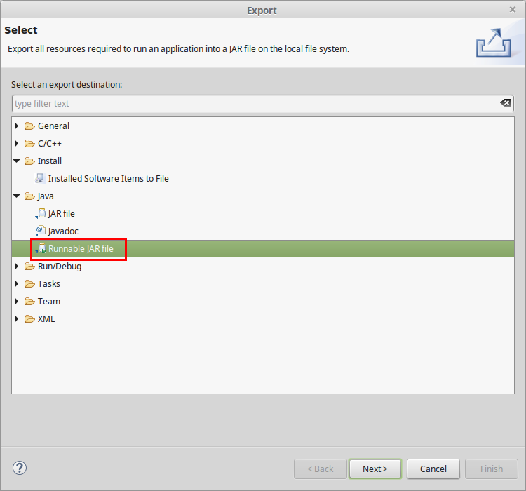
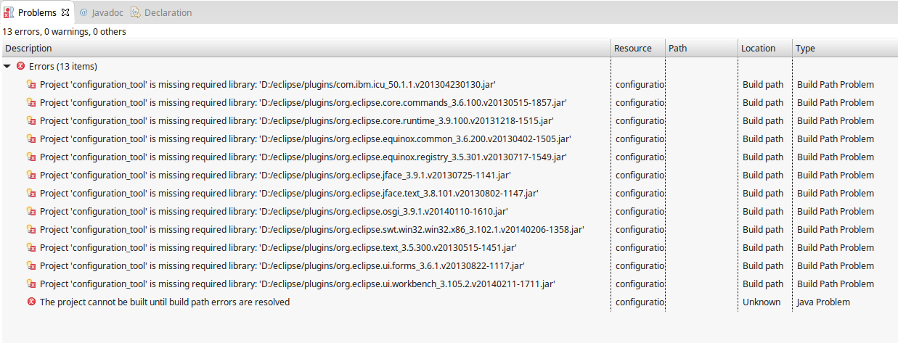
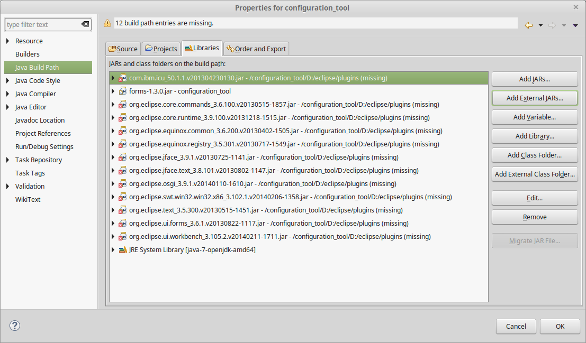
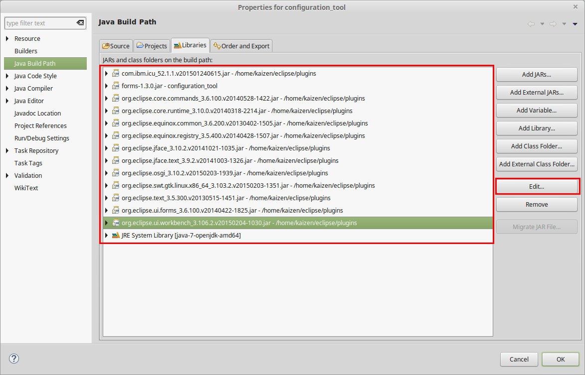

### Project 배포 파일 생성 방법
Project Browser에서 프로젝트를 선택한 후 마우스 오른쪽 버튼 클릭

[Export]-[Java]-[Runnable JAR file] 선택

Launch configuration을 WIZnet_Configuration_Tool로 선택하고 생성될 설치파일이 저장될 경로를 설정 함

### Project 'configuration_tool' is missing required library Error시 해결 방법

본 프로젝트를 Import 한 후, Build 하면 아래와 같은 에러가 발생 할 수 있다.

해당 에러는 Eclipse에서 사용하는 Libary Path가 절대 경로로 되어 있어서 발생한 문제로 판단되며 아래 방법으로 해결 가능 하다.
==(추후 보완이 필요)==

1. x표시 되어 있는 library를 선택하고 Edit 버튼을 클릭
2. 개발 PC의 Eclipse 설치 경로\plugins 폴더에서 해당 library를 선택 ( 버전은 약간 다를 수 있음 )

### java GUI designer plugin 설치 방법

아래 블로그 참고
- [http://xeon011.tistory.com/145](http://xeon011.tistory.com/145)
